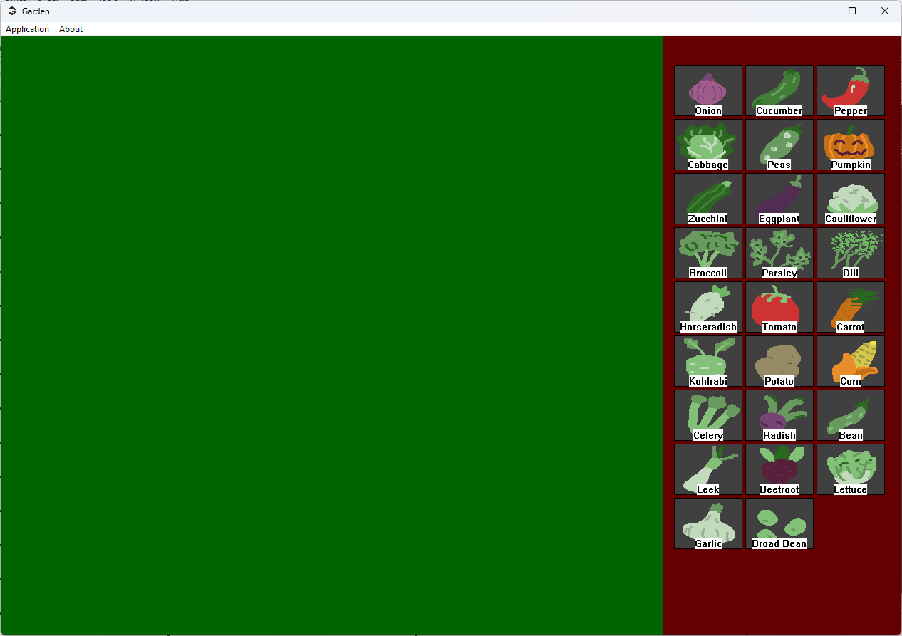
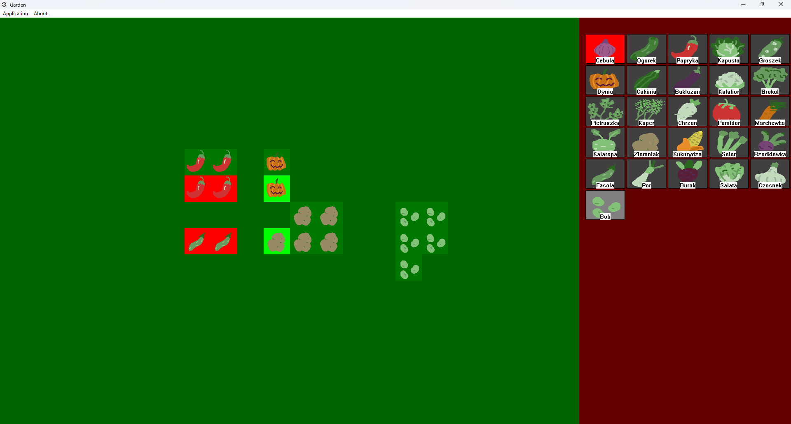

# Garden
Tool that tells you whether your vegetable garden is valid or not.

## Background
People use vegetables as one of the main sources of food. However, many don’t know that 
each vegetable/fruit requires a special kind of neighborhood. Otherwise, the plant might 
not grow properly or catch diseases.

## Description
Application consists of field and side menu. In the side menu, user chooses a vegetable/fruit 
to plant. Each plant has an image and name associated with them. Polish and English being 
the supported languages. Once planted, field recalculates an area trying to find if plants 
around like it.

## Features and Functionalities
Application contains plant database. App allows resizing, saving and loading plant fields.

## Software & Hardware Requirements
Insanely low, anyone with potato PC can run it. There’s a caveat though: it only runs under
Windows due to WinAPI being the only system-level API.
